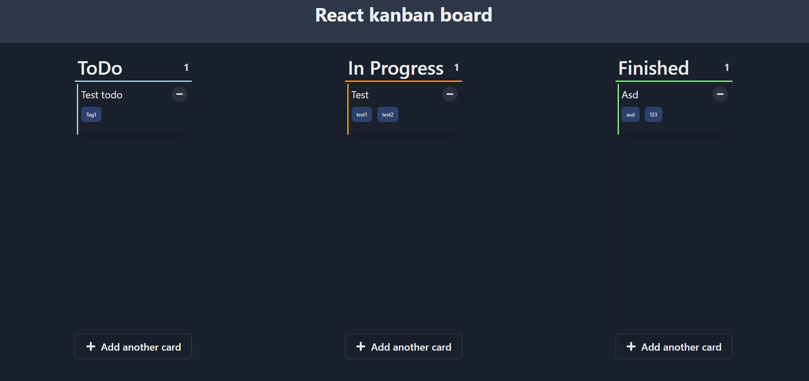

# React kanban board application

## Preview

## Features
- Draggable cards
- ToDo, In Progress and Finished columns
- You can add tags to cards
- Card title
- Data is stored in LocalStorage

## Dependencies
- react-beautiful-dnd
- chakra-ui
- react-icons
- uuidv4